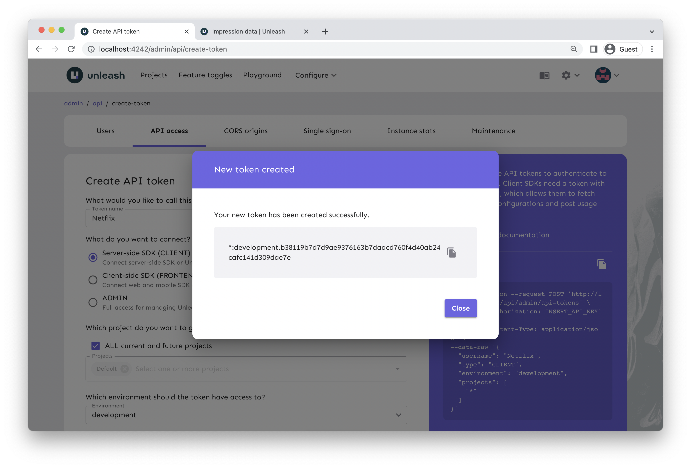

# Part Two
## React and Feature Toggles
#### Step One | Install Dependencies
We'll need to install a few dependencies first. Just run `npm install` and you'll be good! If you open `package.json`, you'll see that one of the packages we're using is `@unleash/proxy-client-react`. This is what we'll be using to community with our Unsplash proxy.

#### Step Two | Generate Client Key
In the project repository, create a new file called `.env.local`. This is where we'll add a client API key for our Unsplash proxy. The reason we use an environment file for this is becase you should never hardcode secrets and API keys! In this case it doesn't matter too much because React is client side, but this is standard practice that you should always follow.

Go back to your Unleash administrator dashboard at `localhost:4242`. Go to **Configure > API Access > New API Token**. Use any name and select the frontend option as shown.


When finished, you'll be shown the token. Press the clipboard icon on the right to copy it. Don't worry if you closed it too soon - you can still see and copy it from the list!



Now head over to your `.env.local` file and throw in the following, but replace the key with the one you were given.

```
REACT_APP_CLIENT_KEY=*:development.6d0f2af805461cba1719d92dbc86efb684a33ed9a66c131dc61f2354
```

#### Step Three | Configure React Application
Before fetching and using our flag, we need to perform some configuration in `index.js`. Start by importing the `FlagProvider` component from Unleash -

```jsx
// Import tools from Unleash
import { FlagProvider } from '@unleash/proxy-client-react';
```

Right below that, create a configuration object as so -

```jsx
const config = {
  url: 'http://localhost:4242/api/frontend',
  clientKey: process.env.REACT_APP_CLIENT_KEY,
  refreshInterval: 30,
  appName: 'netflix',
  environment: 'dev',
};
```

The `appName` field doesn't matter for us so you can name it whatever you'd like. Both environments *should* work, but use development to stay safe. Finally, wrap `<App/>` inside the flag provider.

```jsx
...
<FlagProvider config={config}>
  <App />
</FlagProvider>
...
```

#### Step Four | Retrieve Variant
Time for the fun (and final) step. Open the main project folder in a code editor of your choice (Visual Studio Code is highly recommended) and open `Home.jsx`. Start by importing `useVariant` from the Unleash package we installed.

```jsx
// Import tools from Unleash
import { useVariant } from '@unleash/proxy-client-react';
```

Now, create a new variable for our button variant, which we'll use to determine which styling needs to be applied.

```jsx
const Home = (props) => {
  const variant = useVariant('Button');
  ...
```

We'll also need to expand the `buttonClass` function to account for our variants rather than just returning one (which is used by our button as a class name in the HTML). When you're done, it should look something like this -

```jsx
function buttonClass() {
  switch (variant.name) {
  case "Fill":
    return 'filled';
  case "Ghost":
    return 'ghost';
  case "Clear":
    return "text-only"
  default:
    // Theoretically shouldn't happen
    return "filled"
  }
}
```

#### Step Five | Confirm Your Results
Time to make sure we didn't mess anything up! Run `npm start` and try opening your site (which should be located at `localhost:3000`) in three different web browsers. Hopefully, each one has a different button style that persists between page loads! This is what I saw when I opened it in Chrome, Firefox, and Safari -


